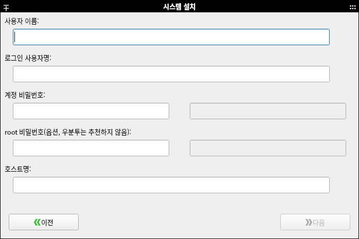
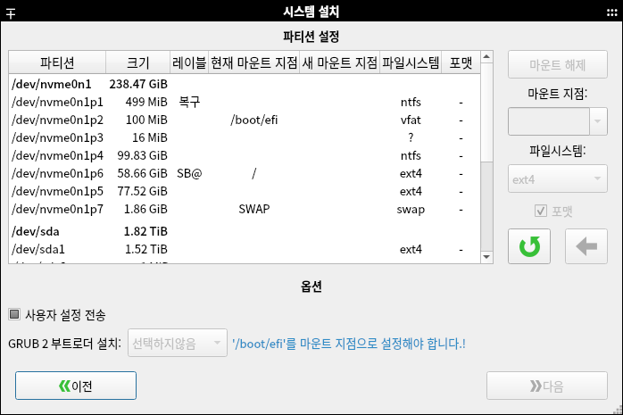

# systemback

systemback 프로그램을 하모니카에서 사용할 수 있도록 새롭게 빌드한 프로젝트입니다.
 - upstream : https://github.com/fconidi/Systemback_source-1.9.4

이 프로그램은 초보자도 쉽게 자신만의 ISO 이미지를 만들어서 배포할 수 있는 프로그램으로
사용중인 자신의 PC 환경을 라이브 이미지로 제작할 수 있는 기능을 제공합니다.

자신이 추가한 프로그램을 포함해서 자신만의 환경으로 설정된 USB를 제작해서 
어디서나 동일한 자신만의 PC 환경을 사용할 수 있으며
이 시스템을 다른 PC에 설치할수 있는 기능을 포함하고 있습니다.

`하드 디스크의 내용과 2G usb persistent 기능을 포함하기 때문에 USB의 크기는 8G 이상 권장`

### 주요 기능 개선 내용
- 하모니카 3.0 지원 (Ubuntu 18.04, LinuxMint 19.01 지원)
- 하모니카 4.0 지원 (Ubuntu 20.04, LinuxMint 20.01 지원)
- `한글 프로그램 인터페이스 지원`
- `라이브 USB로 부팅 후 쓰기 기능 지원` (라이브 부팅 후 바탕화면에 생성된 `SBLIVE` 폴더에 저장하면 부팅해도 내용을 유지)
- `2G usb persistent 기능을 기본으로 제공`하고, ISO 변환하기 기능 비활성화

## 백업하기
* `라이브 시스템 생성` 버튼을 누르면 현재 사용 중인 시스템의 스냅샷을 생성합니다.


## 복원하기
* `시스템 설치` 버튼을 클릭하면 저장된 스냅샷을 하드디스크에 복원합니다. 새로 설치할 시스템의 계정 정보를 입력하고 다음을 누르세요.



* 자신의 하드디스크에 설치할 파티션을 선택하고 마운트 지점을 선택한 후 `엔터`를 누르면 적용됩니다.
* EFI 파티션을 복구하는 경우에는 부트로더 설치를 선택할 수 있습니다.



보다 자세한 사용법은 링크된 문서를 참고하세요.
https://hamonikr.org/used_hamonikr/95052

## 프로그램 설치

### HamoniKR OS 사용자의 경우
```
sudo apt update
sudo apt install systemback
```

### Ubuntu 18.04, 20.04, LinuxMint 19, 20.1 (Ubuntu based Linux)
```
# 하모니카 저장소 추가
curl -sL https://pkg.hamonikr.org/add-hamonikr.apt | sudo -E bash -

sudo apt install systemback
```

## 프로그램 삭제
터미널에서 다음과 같이 입력합니다.

```
sudo apt purge -y systemback systemback-cli systemback-scheduler systemback-locales libsystemback systemback-efiboot-amd64
```

## 이슈 또는 버그
 사용 중 문제를 발견하시면 root@hamonikr.org 또는 https://hamonikr.org 에서 알려주세요.

