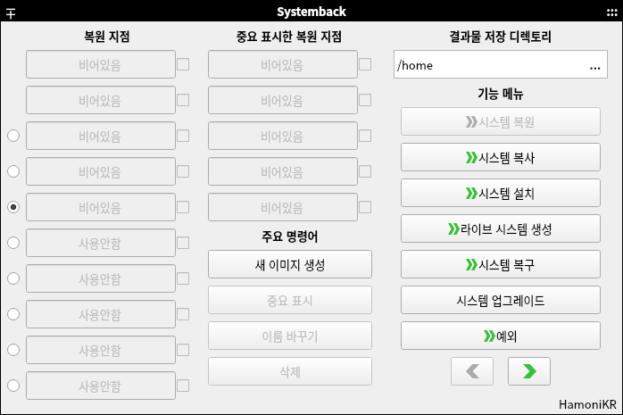
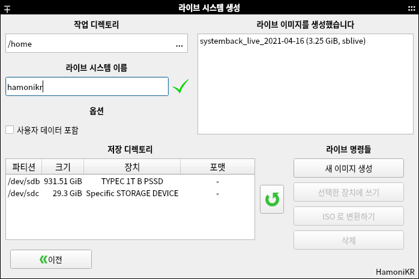

## systemback

Upstream : https://code.launchpad.net/~nemh/systemback/stable

systemback 프로그램을 하모니카에서 사용할 수 있도록 새롭게 빌드한 프로젝트.

- 초보자도 쉽게 자신만의 ISO 이미지를 만들어서 배포할 수 있는 프로그램
- 사용중인 자신의 PC 환경을 라이브 이미지로 제작할 수 있는 기능 제공
- 자신이 수정한 자신만의 환경으로 다른 PC에 설치할수 있는 ISO 이미지를 쉽게
  제작가능
- 한글 인터페이스를 지원하도록 기능 추가
- 하모니카 3.0 에서 빌드하고 검증완료 (Ubuntu 18.04, LinuxMint 19.01 지원)
- 하모니카 4.0 에서 검증완료 (Ubuntu 20.04, LinuxMint 20.01 지원)







## 설치

### HamoniKR OS 사용자의 경우
```
sudo apt update
sudo apt install systemback
```

### Ubuntu 18.04, 20.04, LinuxMint 19, 20.1 (Ubuntu based Linux)
```
# 하모니카 저장소 추가
curl -sL https://pkg.hamonikr.org/add-hamonikr.apt | sudo -E bash -

sudo apt install systemback
```

## clean remove pkg
```
sudo apt purge -y systemback systemback-cli systemback-scheduler systemback-locales libsystemback systemback-efiboot-amd64
```

## 이슈 또는 버그
 사용 중 문제를 발견하시면 root@hamonikr.org 또는 https://hamonikr.org 에서 알려주세요.
